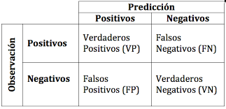
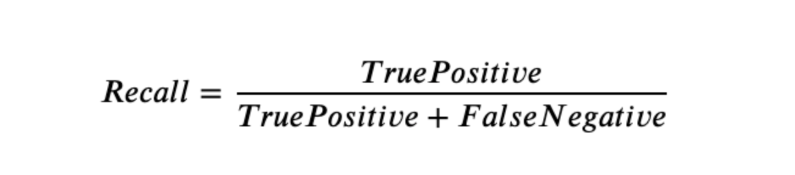

​
## Sector de Analisis: Mercado de Propiedades en Colombia

Se desea estimar la categoria de precios de distintas propiedades en base a informacion pasada, de la cual ya conocemos su precio

Se nos proporciona 2 datasets, uno de train y otro de test, el de Train lo usaremos para armar el modelo de prediccion

## Requerimientos

- Se nos solicita las predicciones que realizamos en un archivo csv
- Tratar los datasets de manera que se pueda alimentar un modelo de ML
- Montar un modelo de ML usando un algoritmo a criterio nuestro

## Metricas de Evaluacion

Para poder medir el rendimiento de las predicciones de nuestro modelo de ML se usaran 2 metricas:
- Matriz de Confusion:

El objetivo de esta metrica es medir las respuestas correctas que puede predecir nuestro modelo, es asi que buscamos que la diagonal compuesta por VP y VN sea mayor a su contraparte

- Recall: Esta metrica se obtiene mediante esta formula

Entre mas cercano sea el valor a 1, mejor sera nuestro modelo

## Normalizacion y Escalamiento de Datos

Revisando los datasets se puede apreciar que los mismos poseen variables categoricas y valores nullos (NaN)

Para el tratamiento de las mismas usaremos 3 algoritmos:

- LabelEncoder: Para la transformacion de variables categoricas a numericas

- KNNImputer: Para el tratamiento e input de valores faltantes, este algoritmo realiza un promedio de valores cercanos a nuestro valor faltante y realiza un promedio para rellenarlo

- MinMaxEscaler: El dataset en este punto ya cuenta con variables totalmente cuantitativas, pero los rangos de las mismas varian bastante una columna respecto de la otra, por lo cual hacemos un procedimiento de escalamiento con este algoritmo

Este procedimiento se debe realizar en ambos datasets con las columnas que vayamos a seleccionar, esta seleccion se realizo a criterio, el output de este proceso de limpieza, normalizacion y escalamiento se encuentra en:

- [dataset train tratado](https://github.com/khorneflakes-dev/Henry-Datathon-Machine-Learning/blob/main/clean_train.csv)

- [dataset test tratado](https://github.com/khorneflakes-dev/Henry-Datathon-Machine-Learning/blob/main/clean_test.csv)

## Modelo de Prediccion Categorica

El algoritmo seleccionado para este proyecto fue el de KNeighborsClassifier o KN Vecinos mas cercanos y como su nombre lo indica este modelo busca predecir valores tomando como referencia los valores mas cercanos a el

## Resultado Prediccion

Como se solicita el resultado de la prediccion con el uso del algoritmo que montamos se encuentra en este archivo 
[prediccion.csv](https://github.com/khorneflakes-dev/Henry-Datathon-Machine-Learning/blob/main/khorneflakes-dev.csv)